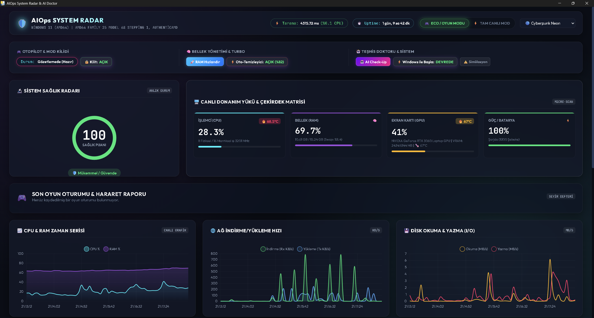

# 🚀 AIOps System Radar // Akıllı Sistem Radarı & Oyun Otopilotu (v5.0)


-00e676?style=for-the-badge&logo=amd)


<p align="center">
  
</p>

**AIOps System Radar**, bilgisayarınızın donanım performansını saniyeler içinde analiz eden, oyunlara **%0 FPS** ve **%0.1 CPU** etki güvencesiyle eşlik eden, tek tıkla **RAM temizliği** yapıp **Yapay Zeka (AI) arıza ve darboğaz teşhisi** sunan yeni nesil otonom bir masaüstü koruma ve sistem takip süitidir!

Kuruluma gerek duyulmaksızın taşınabilir (**Portable .EXE**) olarak çalışır. Harici bir web tarayıcısına gereksinim duymaz; yerleşik **Windows WebView2** penceresinde siber-oyuncu esintili büyüleyici arayüzüyle açılır ve arka planda sağ alt saatin yanındaki sistem tepsisine (System Tray) oturur.

---

## 💎 v5.0 ile Öne Çıkan Devrimsel Özellikler

### 1. ⚙️ CPU Turbo & Ping Optimizatörü (Game Booster Süiti)
- **CPU Yüksek Öncelik:** Oyun saptandığında otomatik olarak işlemi `HIGH_PRIORITY_CLASS` seviyesine alır, arkadaki Discord/Edge/Chrome gibi programları `IDLE` moduna çeker. 
- **Ağ/Ping Koruması:** Oyun sırasında bant genişliği tüketen gereksiz Windows servislerini ve programlarını dondurur (Suspend) ve `ipconfig /flushdns` uygulayarak anlık ping zıplamalarını önler.

### 2. 🧹 VRAM Süpürgesi & Akıllı Arayüz
- **GPU Bellek Alanı Açma:** Özel geliştirilmiş Modal ekranı sayesinde arka planda ekran kartını sömüren (donanım hızlandırmalı) işlemleri anında tespit edip listeler. Kullanıcının onayıyla (tek tıkla) işaretli süreçleri anında kapatır ve VRAM'i tamamen oyuna bırakır.

### 3. 🛡️ UAC Yönetici Modu Entegrasyonu
- Uygulama, yeni donanım öncelik kontrollerini (Suspend/Kill/Priority) kusursuz işletebilmek adına `IsUserAnAdmin` doğrulaması yapar ve eksikse kendini `runas` mekanizması ile **Yönetici yetkisiyle** yeniden başlatarak yetki engellerini yok eder.

### 4. 🎮 Akıllı Oyun Otopilotu & Kilit Anahtarı (Auto Game Detection)
- **Sıfır Müdahale ile Otomatik Yük Atma:** Arka planda bilinen oyun motorlarını (Steam, Epic Games, Unreal, Riot, Valorant, CS2, Cyberpunk 2077 vb.) veya tam ekran yüksek GPU uygulamalarını anında saptar.
- **Eco / Oyun Modu:** Oyun açıldığı saniye tarama aralığını genleştirerek **oyunlarınıza %0 işlemci yükü ve maksimum FPS** sunmak için kendini minimum güç konumuna çeker.

### 5. 🚀 Akıllı RAM Hızlandırıcı & Otomatik Temizleyici (`EmptyWorkingSet`)
- **Native Win32 Trimmer:** Bilgisayarınızın hızlı sistem önbelleğine (Cache / Pagefile) asla zarar vermeden; tarayıcı sekme yığınlarını, arka plan uygulamalarını ve açık process çalışma kümelerini (Working Set) **tek tıkla milisaniyeler içinde süper temizler** (Ortalama **500 MB ile 2.5 GB** arasında anlık yer açılır!).
- **⚡ Oto-Temizleyici Switch:** Arka planda bellek kullanımınız **%82 üstüne çıkarsa** akıllı motor devreye girerek siz hiç oyunu bozmadan sessizce belleğinizi boşaltır!

### 6. 🤖 AI Check-up, Çapraz Hararet Algılama & Seyir Defteri
- Hararet (Thermal Throttling) riski, RAM daralaması, anormal CPU tüketen iplikler anlık olarak taranır ve profesyonel medikal reçeteler üretilir.
- **📖 Seyir Defteri:** Oyundan çıktığınızda veya günün sonunda oyun sürenizi, ulaşılan **Max GPU & CPU sıcağını**, **Max RAM kullanım oranını** ve karne notunuzu kalıcı bir rapor halinde sergiler.

### 7. ⚡ Windows Açılışında Sessiz Nöbet & Kişiselleştirilebilir Temalar
- Kayıt defterine zararsız bir katman ekleyerek tek tuşla **Windows ile Başla** seçeneğini etkinleştirmenizi sağlar. Bilgisayar ilk açıldığında doğrudan saatinizin yanına **System Tray İkonu** olarak gizlenip sessiz nöbete başlar.
- Siber mavi (Cyberpunk), Matrix yeşili (Hacker), Retrowave pembesi ve Magma turuncusu temaları destekler.

---

## 🛠️ Nasıl Çalıştırılır ve Kurulur?

### ⭐ Yöntem 1: Tek-Tık Taşınabilir Uygulama (.EXE) ile (Önerilen)
Hiçbir kodlama veya Python kurulumuna ihtiyacınız yoktur. GitHub üzerindeki **[Releases (Sürümler)](https://github.com/cekYc/real_time_iot_dashboard/releases)** sayfasından son derlenen çalıştırılabilir dosyamızı hemen indirebilirsiniz:
👉 **`AIOps_System_Radar.exe`** (v5.0) indirip direkt çalıştırın!

---

### 💻 Yöntem 2: Kaynak Koddan Geliştirme (Python Ortamı İçin)
Projeyi kod katmanında indirmek ve kendiniz test edip modifiye etmek isterseniz:

1. **Depoyu Bilgisayarınıza Çekin:**
   ```bash
   git clone https://github.com/cekYc/real_time_iot_dashboard.git
   cd real_time_iot_dashboard-main
   ```

2. **Gerekli Python Kütüphanelerini Kurun:**
   ```bash
   pip install -r requirements.txt
   ```
   *(Bağımlılıklar: `flask`, `psutil`, `pystray`, `Pillow`, `pywebview`, `pythonnet`, `wmi`, `requests`)*

3. **Masaüstü Ekosistemini Başlatın:**
   ```bash
   python start_monitor.py
   ```
   *Not: Tarayıcı açmadan doğrudan yerleşik Windows masaüstü ekrana taşınır! Eğer eski sistem harici tarayıcıdan test etmek isterseniz sadece `python backend/app.py` koşturabilirsiniz.*

---

## 🧪 Mimari ve Bileşen Matrisi

| Dosya / Bileşen Katmanı | Çalışma Prensibi & Fonksiyonel Görevi |
| :--- | :--- |
| `start_monitor.py` | Ana masaüstü ateşleyici. WebView2 entegresi ile uygulamayı UAC (Yönetici) olarak açar ve Tray servisiyle köprü kurar. |
| `backend/monitor_engine.py` | Mikrosaniyelik WMI ve psutil tarayıcı matrisi. Autopilot, sıcaklık radarı ve oto-RAM döngüsünü yönetir. |
| `backend/cpu_optimizer.py` | Oyunlarda FPS artışı için işlemci işlemlerini High/Idle önceliklerine akıllıca dağıtır. |
| `backend/ping_optimizer.py` | Oyun esnasında ağ sömüren süreçleri tespit edip dondurur ve DNS sıfırlaması ile lag/gecikmeyi çözer. |
| `backend/ram_booster.py` | Win32 `EmptyWorkingSet` çağrıları ile gereksiz RAM sayfalarını saniyeler içinde sıfırlar. |
| `backend/ai_checkup.py` | Sistem üzerindeki darboğazları ve şüpheli operasyonları irdeleyen yapay zeka analizörü. |
| `backend/startup_manager.py` | Sessiz Windows Başlangıç konfigürasyon katmanı (`HKCU\...\Run`). |
| `backend/tray_service.py` | Sağ alt saatin yanında yaşayan arka plan servis kontrolcüsü (`pystray`). |
| `build_exe.py` | Tüm projenin `pywebview` ve kütüphane bağlarıyla tek dosyalık `.exe` haline derlenmesini sağlayan PyInstaller aracı. |

---

## 👨‍💻 Geliştirici (Developer)
**Ceky** — Software Developer & System Architecture Enthusiast  
*Bu proje otonom sistem takibi ve oyuncu performansı odağıyla tamamen Ceky tarafından tasarlanıp geliştirilmiştir.* 🛡️🚀
